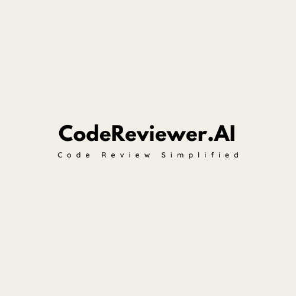

# CodeReviewer.AI

CodeReviewer.AI is an automated pull request review bot that leverages artificial intelligence to analyze and provide suggestions on code changes. It uses Groq's language model to review and suggest improvements for the code in open pull requests, allowing developers to get feedback on their code changes without manual review.

## Features
- Automatically fetches open pull requests from a GitHub repository.
- Analyzes code diffs using Groq's `llama-3.3-70b-versatile` model.
- Posts review comments directly to the GitHub pull request with suggestions for improvement.

## Technologies Used
- **Groq**: We use Groq’s Llama-based model for code review and suggestions.
- **GitHub API**: To interact with the GitHub repository and fetch pull requests.
- **Python**: The main programming language used for developing this bot.
- **GitHub Actions**: For automating the execution of the bot in response to pull requests.

## Requirements 

You will need the following dependencies:

- `groq`: For interacting with Groq's API.
- `requests`: For making API requests to GitHub.
- `pygments`: For code syntax highlighting.

Install the dependencies by running:

```bash
pip install -r requirements.txt
```

## Setup

### Groq API Key

To use the Groq API, you'll need an API key. Set it as an environment variable `GROQ_API_KEY`. If you're using GitHub Actions, you can store it in your repository's secrets.

### GitHub Token

A GitHub token is required to authenticate API requests. Set it as an environment variable `GIT_TOKEN`. You can also add it to the repository secrets.

### Set up GitHub Secrets

Add the following secrets to your GitHub repository:

- **GIT_TOKEN**: Your GitHub Personal Access Token (PAT).
- **GROQ_API_KEY**: Your Groq API key.

### Install Dependencies

Before running the bot, install the necessary dependencies by running:

```bash
pip install -r requirements.txt